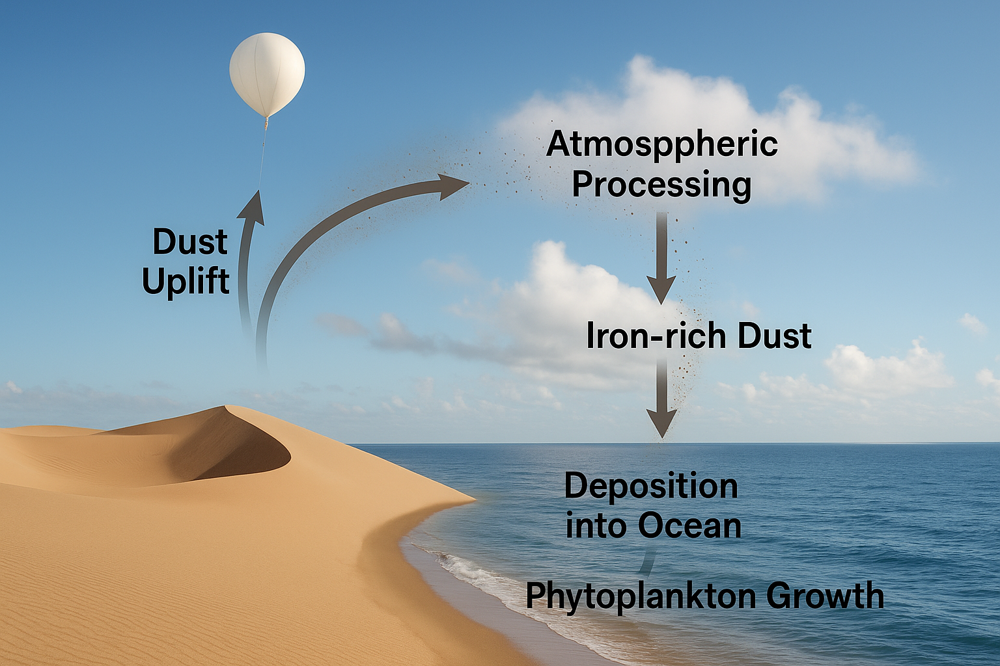

## From Sky to Sea: How High-Altitude Dust Shapes Ocean Ecosystems

Dust, something we rarely associate it with something that is meaningful in our daily life. But in the atmosphere, mineral dust is a powerful driver of ecological and climate processes. Particularly through its role in transporting iron and other trace metals from desert regions to remote parts of the ocean. These particles are not just passengers in the wind, they are critical links between land, air, and sea.

## Scientific Question and Purpose

The central scientific question driving this project is: How do vertical chemical transformations of atmospheric dust influence the solubility of iron and its eventual bioavailability to phytoplankton in remote ocean regions? Despite growing recognition of dust’s role in ocean fertilization and climate regulation, a lack of vertical observational data limits our understanding of the processes that transform insoluble iron into its bioavailable form during atmospheric transport. This project proposes a high-altitude sampling campaign to directly investigate those chemical changes and close the existing knowledge gap.

## Why Atmospheric Dust Matters

Atmospheric dust, lifted primarily from deserts like the Sahara and Gobi, travels thousands of kilometers through the troposphere, eventually settling on land or ocean surfaces. During this journey, dust carries trace elements—especially iron—essential to marine phytoplankton. These microscopic plants form the base of the marine food web and play a significant role in carbon dioxide uptake through photosynthesis.

In ocean regions such as the Southern Ocean and the North Pacific, where macronutrients are abundant but iron is scarce, dust acts as a natural fertilizer. Jickells et al. (2005) documented how dust delivery to the open ocean significantly influences phytoplankton productivity and, by extension, global carbon cycles.

But beyond ecological significance, the economic impacts are substantial. Healthy phytoplankton populations support fisheries that millions of people rely on for food and livelihood. Iron fertilization from dust influences the productivity of commercial fisheries, such as those in the North Pacific and Southern Ocean. Moreover, by driving photosynthetic carbon uptake, phytoplankton contribute to natural carbon sequestration, a process that has implications for global climate regulation and carbon credit markets. Regions that benefit from dust fertilization may experience enhanced marine yields, potentially altering the economic balance of coastal and island nations.

However, the iron must be in a soluble form to be usable by marine organisms. Most desert dust is composed of insoluble iron minerals, and its transformation into bioavailable forms depends on complex chemical reactions during atmospheric transport.

  
## The Vertical Data Gap

Most studies have focused on surface-level or satellite observations to understand dust transport and transformation. While these are valuable, they miss critical vertical processes occurring in the mid- and upper troposphere. It is at these altitudes where dust particles are most actively exposed to photochemical reactions, acidic gases, and organic compounds. These are factors that significantly influence their solubility.

Kok et al. (2023) emphasize that particle morphology, chemical reactivity, and climate interactions vary with altitude. Without vertical observational data, our models of how dust transforms chemically and radiatively remain incomplete. This knowledge gap limits our ability to accurately predict how dust contributes to both nutrient delivery and radiative forcing.

## High-Altitude Balloon Sampling 

To better understand these vertical transformations, researchers propose deploying high-altitude balloons equipped with multi-stage aerosol samplers. These devices would collect particles at stratified altitudes across the lower and middle troposphere, enabling the identification of changes in chemical composition, morphology, and solubility. Instruments may include filter cassettes, cascade impactors, and real-time optical counters. Sampling durations can be adjusted to align with meteorological conditions and targeted dust plume events. By analyzing retrieved filters using techniques such as ICP-MS (Inductively Coupled Plasma Mass Spectrometry), researchers can quantify trace metal concentrations and solubility under varying atmospheric conditions. This would allow scientists to analyze chemical composition across different altitudes, measure iron solubility and other indicators of bioavailability and to a boarder implication, to refine global climate and biogeochemical models.

Unlike satellites or ground-based sensors, balloons can physically retrieve particulate samples from otherwise inaccessible air columns. This strategy builds on earlier remote sensing and lab-based work, offering a feasible and cost-effective path to fill long-standing observational gaps.

## Climate and Ecosystem Implications

The need for improved dust modeling is growing. Climate change is accelerating desertification in many regions, potentially increasing global dust emissions. At the same time, shifts in wind patterns and precipitation alter where and how dust is transported. Ito et al. (2021) modeled how dust grain size and shape influence atmospheric radiative heating—critical variables in determining dust longevity, altitude, and eventual deposition zones.

Understanding these dynamics is especially relevant for ocean ecosystems that rely on sporadic dust inputs. As Fietz et al. (2017) showed, iron from dust can impact marine productivity even after it settles into sediments. Loell et al. (2011) extended this further, demonstrating that rare earth elements in dust affect both aquatic and terrestrial biogeochemistry.

Moreover, while the focus of this research is on oceanic implications, there are broader health concerns. Gao et al. (2018) found that dust in urban environments often contains bioaccessible toxic metals. This underscores the importance of knowing what elements are present in dust and how they change chemically with altitude—not just for marine ecosystems, but for human exposure as well.

## Why It Matters

Improving our understanding of airborne dust is not just a matter of academic interest. It could transform how we model climate feedbacks, forecast ocean productivity, and even assess the feasibility of carbon sequestration strategies that depend on ocean fertilization.

This research direction is timely, practical, and scientifically urgent. By bridging the gap between sky and sea, we can better understand the invisible threads that connect Earth’s most extreme environments—and the life systems that depend on them.

## References
[1] Gao, P., Guo, H., Zhang, Z., Ou, C., Hang, J., Fan, Q., He, C., Wu, B., Feng, Y., & Xing, B. (2018). Bioaccessibility and exposure assessment of trace metals from urban airborne particulate matter (PM10 and PM2.5) in simulated digestive fluid. Environmental Pollution, 242, 1661–1668. 
https://doi.org/10.1016/j.envpol.2018.07.109

[2] Ito, A., Adebiyi, A. A., Huang, Y., & Kok, J. F. (2021). Less atmospheric radiative heating by dust due to the synergy of coarser size and aspherical shape. Atmospheric Chemistry and Physics, 21(21), 16869–16891. 
https://doi.org/10.5194/acp-21-16869-2021

[3] Jickells, T. D., An, Z. S., Andersen, K. K., Baker, A. R., Bergametti, G., Brooks, N., et al. (2005). Global iron connections between desert dust, ocean biogeochemistry, and climate. Science, 308(5718), 67–71. 
https://doi.org/10.1126/science.1105959

[4] Kok, J. F., Storelvmo, T., Karydis, V. A., Adebiyi, A. A., Mahowald, N. M., Evan, A. T., et al. (2023). Mineral dust aerosol impacts on global climate and climate change. Nature Reviews Earth & Environment, 4(2), 71–86. 
https://doi.org/10.1038/s43017-022-00379-5

[5] Fietz, S., Ratmeyer, V., Rosell-Melé, A., & Martinez-Garcia, A. (2017). Dust deposition and legacy iron fertilization in the Antarctic Zone. Geophysical Research Letters, 44(10), 5003–5010. 
https://doi.org/10.1002/2017GL073186

[6] Loell, M., et al. (2011). Atmospheric deposition of rare earth elements to terrestrial ecosystems. Environmental Pollution, 159(10), 2654–2660. 
https://doi.org/10.1016/j.envpol.2011.06.002

### *Thank You for Reading ;)*
